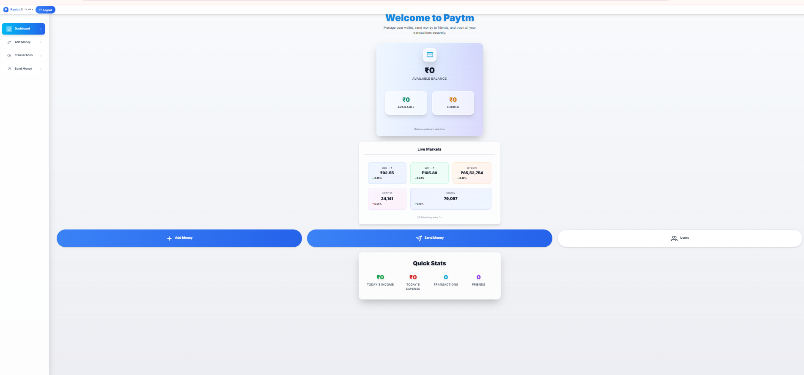
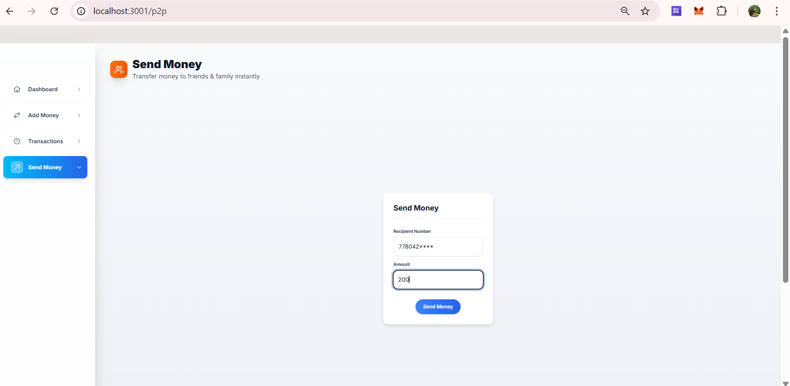
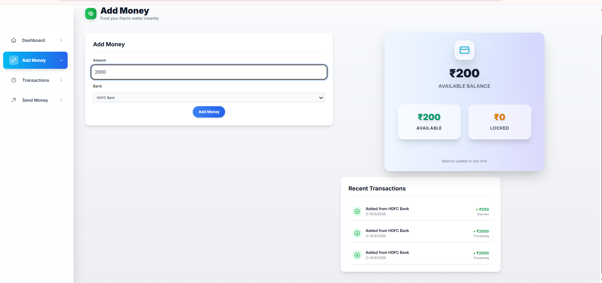
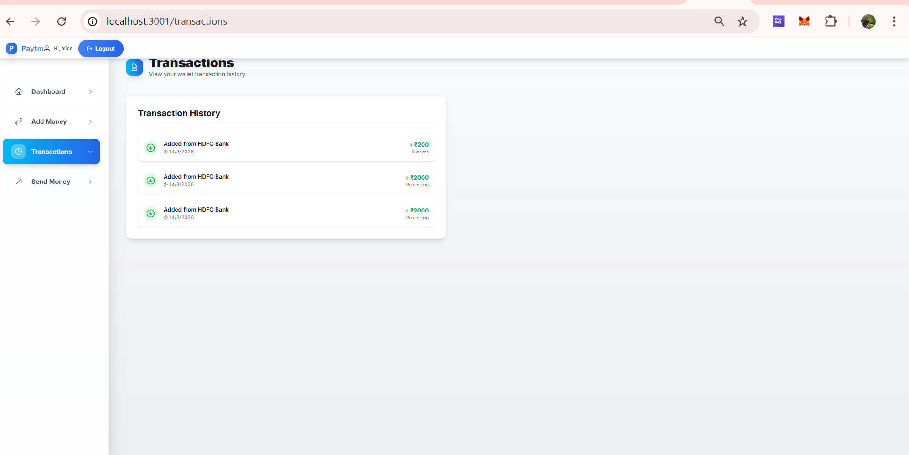

# Paytm Wallet Clone

A modern fintech wallet application built with Next.js, Prisma and PostgreSQL.

## Features

- Wallet balance management
- Add money via bank
- Send money (P2P transfers)
- Transaction history
- Live market dashboard (USD, EUR, BTC, NIFTY, SENSEX)
- Modern Paytm-style UI

## Screenshots

### Dashboard


### Send Money


### Add Money


### Live Markets


### Transactions


## Tech Stack

- Next.js 14
- TailwindCSS
- Prisma ORM
- PostgreSQL
- NextAuth
- React Icons

## Run Locally

```bash
npm install
npm run dev
